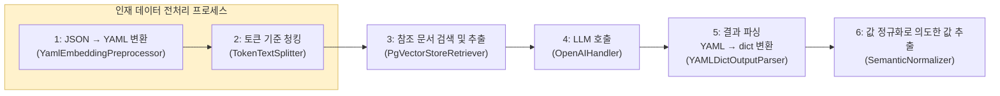
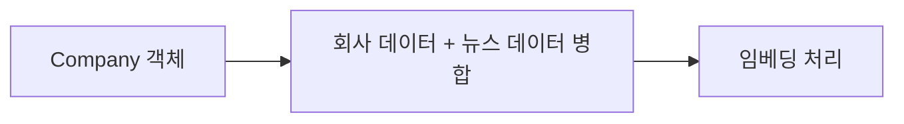

기존 README.md에 있던 과제 내용은 [ASSIGNMENT.md](./ASSIGNMENT.md)로 옮겼습니다.

## FlowChart

### LLM 기반 경험 판단 시스템 플로우


### 사전 임베딩 플로우


## 사전 세팅
```
docker-compose up -d
poetry install
poetry run ./manage.py setuptables
poetry run ./manage.py embed # 임베딩 작업 실행 (약 2분)
poetry run ./manage.py runserver
```

## 테스트 방법

### 목표 데이터셋
```
make test-api FILE=example_datas/talent_ex4.json
```

### 성공 테스트셋
```
make test-api FILE=example_datas/talent_ex1.json
make test-api FILE=example_datas/talent_ex2.json
make test-api FILE=example_datas/talent_ex3.json
```